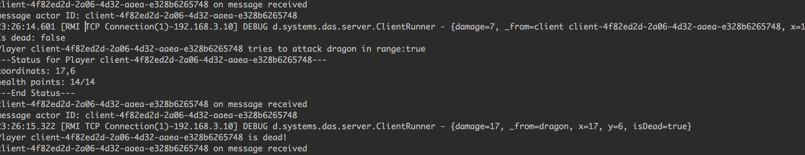
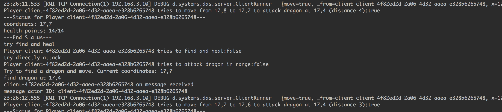
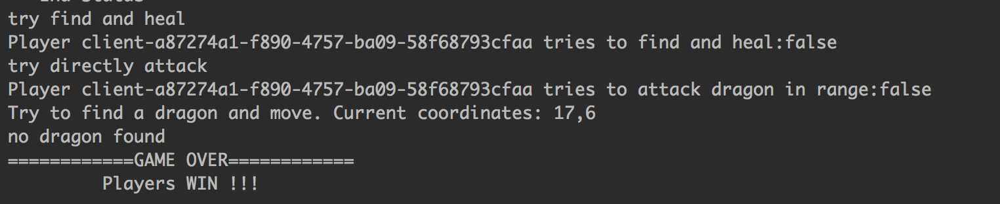

# Distributed Systems [Group10]

## To build and run Server
To create executable jar file run this command from project root
```
$ mvn clean compile assembly:single
$ java -jar target/server-jar-with-dependencies.jar 5001
```

## To run Client
- After starting the server, select ClientRunner.main() as the entry
point and run the program.
- For now, we can only run multiple clients separately, which means
a new ClientRunner.main() can only be executed when the previous one
has printed "Player \<ClientID\> is dead".
- The game will end if there is no dragon in the battlefield.

## Log examples
- attack

- move

- game over



